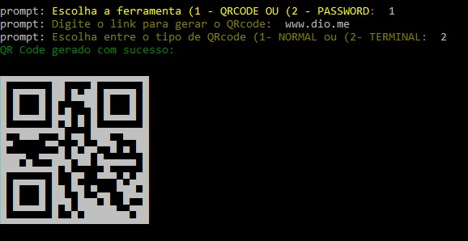
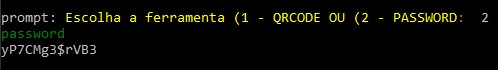

<h1>Gerador de QRCode e Senhas		</h1>

<h2>Objetivo 🎯</h2>

Criar uma aplicação console para gerar QRcode e senhas com Node.js. O projeto faz parte do cusro de formação Node.js Fundamentals, da plataforma de ensino <a href="https://www.dio.me/" target="_blank"> DIO (Digital Inovation One)</a>.

  

